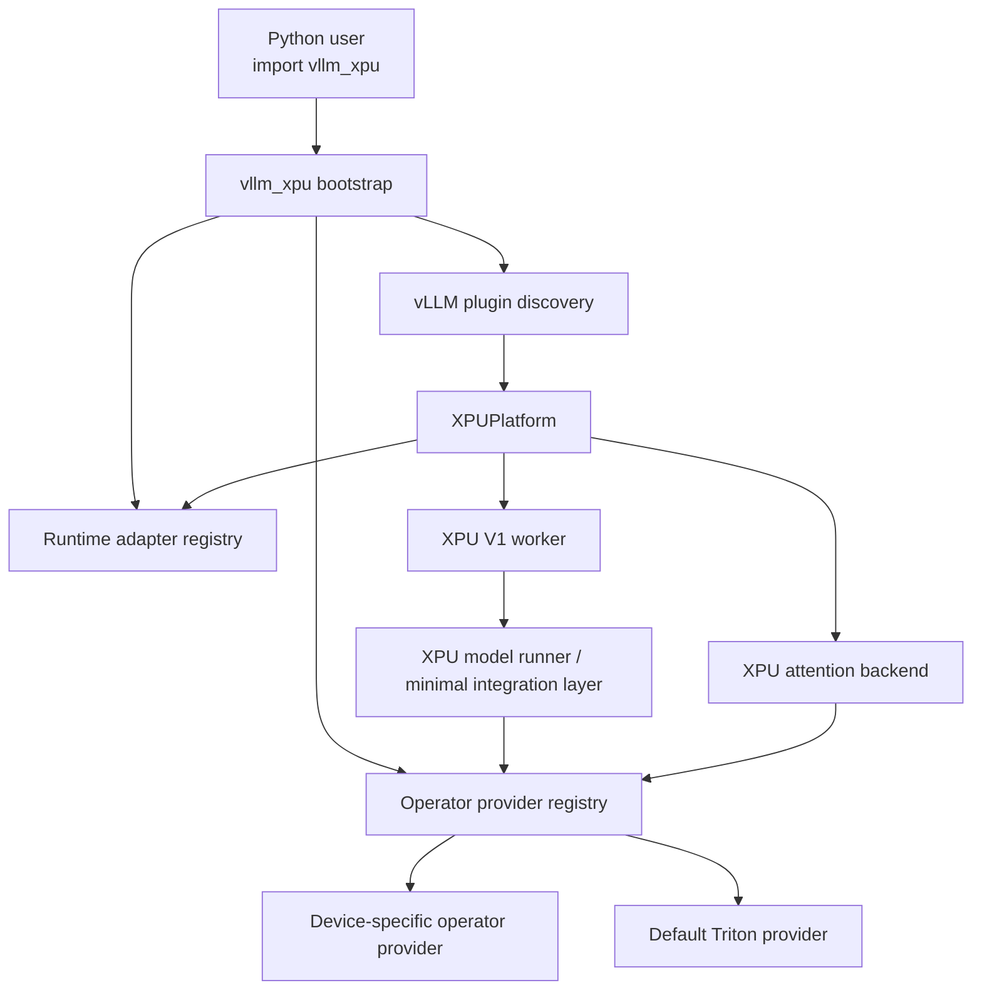

# feat: 构建 vLLM XPU 基础框架

## 概述

构建一个最小可用的 out-of-tree `vllm_xpu` 插件，让用户只安装 `vllm-cpu`，再 `import vllm_xpu`，就能通过统一的 `xpu` 包在 GPU 或类 GPU 设备上运行单卡 BF16 推理。

第一阶段实现应刻意保持小而稳：
- 只支持 vLLM V1
- 先支持一个最小模型族
- 先内置一套默认 Triton 算子 provider
- 明确保留 runtime adapter 与算子组 override 的扩展点
- 除非 upstream 没有更窄的接入点，否则避免走 `vllm-mlu` 风格的大面积 hijack

## 问题背景

origin requirements 文档把通用 `xpu` 定义为一层很薄的框架，而不是一个新的设备专有分叉。真正的技术挑战不是“让某个设备先跑起来”，而是把这个产品方向翻译成一个在 vLLM 真实约束下仍然简洁的实现形态：
- vLLM 通过 Python entry points 发现 out-of-tree 平台
- platform plugin 必须可重入，并能安全地在多个进程中加载
- vLLM 的平台接口比我们真正想持有的最小 runtime 合同更宽
- `vllm-mlu` 证明了插件路径可行，但也说明一旦平台、worker、模型执行路径一起定制，复杂度会迅速膨胀

因此，这个计划将第一阶段收敛到最小有用切片：只做 V1、只做 decoder-only、只做 BF16，并以默认 Triton provider 和一个小型 runtime adapter 合同为核心（见 origin: `docs/brainstorms/vllm-xpu-requirements.md`）。

## 需求映射

- R1. 交付一个统一的 `vllm_xpu` 包，并只暴露一个品牌化的 `xpu` 平台入口。
- R2. 第一阶段只支持单卡 BF16 推理。
- R3. 保持 Python 启用体验：安装包后 `import vllm_xpu`，再正常使用 `vllm.LLM(...)`。
- R4. 通过最小 runtime adapter 合同承接设备差异，而不是在平台代码里硬编码 CUDA 或 MLU 语义。
- R5. 提供一个默认 Triton 算子 provider，并覆盖第一阶段支持的最小模型路径。
- R6. 算子替换发生在“算子组”粒度，而不是零碎单算子粒度。
- R7. 支持设备定制 provider 部分覆盖，并回退到默认 Triton provider。
- R8. 优先使用官方插件与平台扩展点，而不是大面积 hijack。
- R9. 显式排除量化、通信、多卡、MoE 和 CLI 兼容。
- R10. 扩展点要稳定，但不能为了未来可能性而过度抽象。

## 范围边界

- 不支持量化路径、FP8 路径、AWQ/GPTQ/SmoothQuant 或 weight-only kernels。
- 不支持分布式执行、Ray 集成、通信插件、自定义 all-reduce，或任何超过 vLLM V1 单 worker 所需范围的拓扑工作。
- 不支持 MoE、专家路由、共享专家和 MoE 专用算子。
- 第一阶段不支持 `vllm serve` 或 CLI-first 使用方式。
- 不试图覆盖 vLLM 中所有模型架构。
- 不承诺“任意加速器 runtime 零适配即运行”。

## 上下文与调研

### 相关代码与模式

- `../vllm-mlu/setup.py`
  - 展示了 out-of-tree 包形态，以及通过 `vllm.platform_plugins` / `vllm.general_plugins` 注册入口的方式。
- `../vllm-mlu/vllm_mlu/__init__.py`
  - 展示了最小可用注册面：一个 platform plugin 和一个 general plugin。
- `../vllm-mlu/vllm_mlu/platforms/mlu.py`
  - 展示了 OOT 平台如何选择 attention backend、更新 config、选择 worker class。
- `../vllm-mlu/vllm_mlu/v1/worker/gpu_worker.py`
  - 说明在 V1 中，自定义 worker 是设备初始化和显存度量的现实接入点。
- `../vllm-mlu/vllm_mlu/v1/attention/backends/flash_attn.py`
  - 说明 attention backend 替换是 V1 的一级接入面。
- `../vllm-mlu/vllm_mlu/model_executor/layers/activation.py`
- `../vllm-mlu/vllm_mlu/model_executor/layers/layernorm.py`
- `../vllm-mlu/vllm_mlu/model_executor/layers/rotary_embedding.py`
  - 展示了当 upstream 缺少 provider registry 时，当前常见的 fallback 接入方式。

### 历史经验

- 当前仓库没有 `docs/solutions/` 内容，因此没有本地 institutional learnings 可继承。

### 外部参考

- vLLM plugin system docs: https://docs.vllm.ai/en/v0.9.0/design/plugin_system.html
  - 确认 platform plugins 和 general plugins 是官方扩展机制，并要求 plugin function 可重入。
- vLLM platform interface docs: https://docs.vllm.ai/en/v0.9.0/api/vllm/platforms/interface.html
  - 确认平台 hook 面，包括 `get_attn_backend_cls`、`check_and_update_config` 和设备相关方法。
- vLLM platforms API docs: https://docs.vllm.ai/en/v0.13.0/api/vllm/platforms/
  - 确认 `pre_register_and_update` 明确用于 OOT 平台在 config 初始化前做注册或更新。

## 关键技术决策

- **第一阶段只做 V1：** 这样可以消除 v0/v1 双路径复杂度，也和当前 `vllm-mlu` 的方向一致，同时符合“单卡 BF16 only”的范围。
- **第一阶段模型范围限制为 decoder-only 的 Llama/Qwen 类架构：** 最小支持面定义为 RMSNorm + RoPE + MHA/GQA + SwiGLU + 标准 dense projections + LM head。这是当前价值最高、同时又足够小的 BF16 causal LM 路径。
- **使用 packaging entry points 作为标准接入机制，并把 `import vllm_xpu` 作为显式 Python bootstrap：** entry points 负责满足 vLLM 的多进程插件发现要求，import 负责满足你要的用户入口体验。
- **拆成两个 registry，而不是一个：** runtime adapter registry 管设备语义，operator provider registry 管算子替换语义，两者应独立演进。
- **把算子组视作稳定的产品扩展面：** 第一阶段固定为 `attention`、`linear`、`norm_act`、`rotary`。
- **优先窄接入点，避免广域 hijack：** 优先使用平台方法、worker 选择、attention backend 选择、`CustomOp` / `forward_oot` 等 seam；只有在 upstream 没有更窄接口时才 patch 核心类。
- **回退规则必须显式：** 算子解析顺序固定为“设备 override -> 包内默认 Triton provider -> 报错”。
- **实现命名需要与 upstream 内建 `XPU` 语义谨慎解耦：** 对外产品名仍是 `vllm_xpu`，但实现上不要在审计目标版本之前，把自己绑定到 upstream `PlatformEnum.XPU` 的假设上。

## 开放问题

### 规划阶段已解决

- **最小 runtime adapter 合同包含哪些方法？**
  - `is_available() -> bool`
  - `device_type() -> str`
  - `dispatch_key() -> str`
  - `set_device(torch.device) -> None`
  - `synchronize() -> None`
  - `empty_cache() -> None`
  - `mem_get_info() -> tuple[int, int]`
  - `get_device_name(device_id: int = 0) -> str`
  - `get_device_total_memory(device_id: int = 0) -> int`
  - `get_device_capability(device_id: int = 0) -> object | None`
  - `inference_mode() -> ContextManager`
  - 这个合同刻意小于 vLLM 完整 `Platform` 接口；`XPUPlatform` 负责把 vLLM 更宽的平台接口适配到这组最小方法上。

- **第一阶段算子组固定为哪些？**
  - `attention`：prefill / decode 的 paged attention 或 flash-attention 风格路径
  - `linear`：dense projection matmul 路径，包括 LM head
  - `norm_act`：RMSNorm 与 SwiGLU / QuickGELU 一类融合激活所需路径
  - `rotary`：RoPE 应用和相关 metadata 处理

- **默认 Triton provider 第一阶段支持哪些模型？**
  - 只支持 Llama/Qwen 类 decoder-only BF16 causal LM。

- **是否默认需要自定义 worker？**
  - 需要。对于设备初始化、显存度量和 adapter 驱动的设备控制，自定义 V1 worker 是最干净的接入面。

### 延后到实现阶段

- **目标 vLLM 版本里是否已经保留了 `device_type="xpu"` 且会与本插件冲突：**
  - 这需要在实现分支里对目标版本源代码做版本级审计。

- **`linear`、`RMSNorm`、`QuickGELU` / `SwiGLU`、`rotary` 的窄 patch 形态最终如何落地：**
  - 先保持灵活，等真正审计目标版本后再决定哪些地方有现成 hook，哪些需要最小 patch。

- **默认 Triton provider 是否适合在内部做一层共享 backend utils：**
  - 留到实现阶段，根据真实 kernel 与 metadata 共享程度再定。

## 高层技术设计

> *This illustrates the intended approach and is directional guidance for review, not implementation specification. The implementing agent should treat it as context, not code to reproduce.*



方向性的解析规则如下：

```text
for each operator group request:
  if active runtime names an override provider for the group:
    use that provider
  else if package default Triton provider implements the group:
    use Triton provider
  else:
    raise a clear unsupported-path error
```

## 实施单元

- [x] **Unit 1: 包骨架与插件 bootstrap**

**目标：** 建立包结构、打包元数据和官方 bootstrap 面，让 `vllm_xpu` 能被 vLLM 发现，也能被 Python 用户显式 import。

**对应需求：** R1, R3, R8

**依赖：** 无

**文件：**
- 新建：`pyproject.toml`
- 修改：`README.md`
- 新建：`vllm_xpu/__init__.py`
- 新建：`vllm_xpu/bootstrap.py`
- 新建：`vllm_xpu/plugins.py`
- 新建：`examples/offline_inference.py`
- 测试：`tests/unit/test_package_entrypoints.py`
- 测试：`tests/unit/test_python_bootstrap.py`

**方案：**
- 在 `pyproject.toml` 中使用 setuptools entry points 同时注册 `vllm.platform_plugins` 和 `vllm.general_plugins`。
- plugin function 必须按 vLLM 要求保持可重入、无危险副作用。
- `import vllm_xpu` 只负责包内 bootstrap，不依赖全局 monkey-patching。
- 在 `README.md` 中明确文档化唯一支持的使用顺序：先 `import vllm_xpu`，再构造 `LLM`。
- bootstrap 层保持极薄，只做 adapter/provider 注册，不在这里做 worker/model patch。

**参考模式：**
- `../vllm-mlu/setup.py`
- `../vllm-mlu/vllm_mlu/__init__.py`

**测试场景：**
- entry points 只暴露一个 platform plugin 和一个 general plugin。
- 重复 import `vllm_xpu` 不会重复注册或崩溃。
- 在没有激活任何 adapter 的 CPU-only 环境中，`import vllm_xpu` 不应触发设备初始化。

**完成判定：**
- 该包能在 CPU-only Python 环境中被导入，而不会过早触发设备初始化。
- 插件注册函数是幂等且可被打包元数据发现的。

- [x] **Unit 2: Runtime adapter 与 operator-provider 双 registry**

**目标：** 定义两个核心扩展面，使 `xpu` 真正通用，而不是把后续设备都耦合到默认 Triton 实现上。

**对应需求：** R4, R6, R7, R10

**依赖：** Unit 1

**文件：**
- 新建：`vllm_xpu/runtime/__init__.py`
- 新建：`vllm_xpu/runtime/base.py`
- 新建：`vllm_xpu/runtime/registry.py`
- 新建：`vllm_xpu/runtime/defaults.py`
- 新建：`vllm_xpu/ops/__init__.py`
- 新建：`vllm_xpu/ops/groups.py`
- 新建：`vllm_xpu/ops/provider.py`
- 新建：`vllm_xpu/ops/registry.py`
- 测试：`tests/unit/runtime/test_runtime_registry.py`
- 测试：`tests/unit/ops/test_operator_registry.py`

**方案：**
- runtime adapter 用小型 protocol / ABC 建模，registry 显式注册，不做隐式模块扫描。
- operator provider 用“支持哪些算子组”的能力集建模，而不是散乱的函数映射。
- 部分 override 通过 lookup 时合并 provider 能力实现，而不是强制 provider 之间继承。
- 对“没有 runtime adapter”“runtime adapter 不可用”“算子组不支持”提供明确诊断。

**执行说明：** 这一单元适合 test-first。registry 语义是后续所有接入的根，值得先锁死。

**参考模式：**
- 借鉴 `../vllm-mlu/vllm_mlu/mlu_hijack_utils.py` 的幂等注册姿态，但不要继承它的广域全局 patch 模型。

**测试场景：**
- 重复注册相同 runtime adapter 时，行为要么被拒绝，要么按文档策略做确定性替换。
- 某个设备 provider 只 override `attention` 时，其他算子组仍会回退到默认 Triton。
- registry 报错要能明确指出缺的是 runtime 还是 operator group。

**完成判定：**
- 不依赖 vLLM 内部实现，也能独立解析当前 active runtime adapter 和最终生效的 operator provider 集合。

- [x] **Unit 3: XPU platform 与 V1 worker/model-runner 集成**

**目标：** 引入具体的 out-of-tree 平台实现，把 vLLM 的平台合同适配到 runtime adapter 合同，并把执行路径路由到最小 XPU V1 worker 路径。

**对应需求：** R1, R2, R4, R8, R9

**依赖：** Unit 2

**文件：**
- 新建：`vllm_xpu/platforms/__init__.py`
- 新建：`vllm_xpu/platforms/xpu.py`
- 新建：`vllm_xpu/worker/__init__.py`
- 新建：`vllm_xpu/worker/worker.py`
- 新建：`vllm_xpu/worker/model_runner.py`
- 新建：`vllm_xpu/worker/memory.py`
- 测试：`tests/unit/platforms/test_xpu_platform.py`
- 测试：`tests/unit/worker/test_xpu_worker_config.py`
- 测试：`tests/unit/worker/test_runtime_adapter_bridge.py`

**方案：**
- 实现一个唯一的 `XPUPlatform` 类，作为包对外暴露的唯一平台。
- 在 `check_and_update_config` 中强制或验证只走 V1。
- 在 config update 阶段显式拒绝超范围功能：量化、多卡并行、MoE、不支持的 model runner 类型，以及会暗含 unsupported backend 假设的 CLI 场景。
- 所有设备相关方法都通过 active runtime adapter 代理，而不是直接 import 某个设备专属 torch namespace。
- 显式选择自定义 XPU V1 worker，让设备初始化和显存度量由本包掌控，而不是借用 CUDA 假设。
- model runner 保持极薄，只承接 attention metadata、RoPE metadata 和 operator-provider lookup 到模型执行路径的桥接逻辑。

**参考模式：**
- `../vllm-mlu/vllm_mlu/platforms/mlu.py`
- `../vllm-mlu/vllm_mlu/v1/worker/gpu_worker.py`
- `../vllm-mlu/vllm_mlu/v1/worker/gpu_model_runner.py`

**测试场景：**
- unsupported config 需要尽早、明确地报错。
- 单卡 BF16 config 会正确选择 XPU worker 路径。
- platform 的设备方法通过 runtime adapter 代理，而不是直接依赖设备专属 torch API。
- `tensor_parallel_size == 1` 时不应激活任何 distributed-only 路径。

**完成判定：**
- 平台初始化、config 校验和 worker 选择均由 `vllm_xpu` 自身掌控，不依赖广域全局 patch。

- [ ] **Unit 4: 默认 Triton provider 与窄算子集成**

**目标：** 加入默认计算实现，并把第一阶段所需算子组路由到 provider-backed 执行路径。

**对应需求：** R2, R5, R6, R7, R8, R10

**依赖：** Unit 3

**文件：**
- 新建：`vllm_xpu/attention/__init__.py`
- 新建：`vllm_xpu/attention/backends/__init__.py`
- 新建：`vllm_xpu/attention/backends/flash_attn.py`
- 新建：`vllm_xpu/model_executor/__init__.py`
- 新建：`vllm_xpu/model_executor/layers/__init__.py`
- 新建：`vllm_xpu/model_executor/layers/linear.py`
- 新建：`vllm_xpu/model_executor/layers/activation.py`
- 新建：`vllm_xpu/model_executor/layers/layernorm.py`
- 新建：`vllm_xpu/model_executor/layers/rotary_embedding.py`
- 新建：`vllm_xpu/ops/triton/__init__.py`
- 新建：`vllm_xpu/ops/triton/attention.py`
- 新建：`vllm_xpu/ops/triton/linear.py`
- 新建：`vllm_xpu/ops/triton/norm_act.py`
- 新建：`vllm_xpu/ops/triton/rotary.py`
- 新建：`vllm_xpu/ops/providers/triton_provider.py`
- 测试：`tests/unit/attention/test_flash_attn_backend.py`
- 测试：`tests/unit/model_executor/layers/test_linear_dispatch.py`
- 测试：`tests/unit/model_executor/layers/test_norm_act_dispatch.py`
- 测试：`tests/unit/model_executor/layers/test_rotary_dispatch.py`
- 测试：`tests/unit/ops/providers/test_triton_provider_fallback.py`

**方案：**
- 注册一个默认 Triton provider，并声明自己实现了四个 phase-1 算子组。
- provider lookup 位于 kernel 之上；kernel 不应知道自己是默认实现还是 override 实现。
- attention 优先走 vLLM 的 attention backend 选择 seam。
- 其余算子组优先走最窄可用 seam：
  - 有清晰 custom op 接口时优先 `CustomOp.register`
  - vLLM 显式提供 OOT 执行 hook 时优先 `forward_oot`
  - 两者都没有时，才做最小本地 patch 包装
- 不修改无关的 executor、metric、logger 或 distributed 类。

**技术设计：** *(方向性指导，不是实现规范。)*

```text
attention path:
  XPUPlatform.get_attn_backend_cls -> XPU flash attention backend
  backend impl -> operator registry -> provider.attention implementation

layer path:
  layer forward_oot or CustomOp wrapper -> operator registry -> provider.group implementation
```

**参考模式：**
- `../vllm-mlu/vllm_mlu/v1/attention/backends/flash_attn.py`
- `../vllm-mlu/vllm_mlu/model_executor/layers/activation.py`
- `../vllm-mlu/vllm_mlu/model_executor/layers/layernorm.py`
- `../vllm-mlu/vllm_mlu/model_executor/layers/rotary_embedding.py`

**测试场景：**
- attention backend 必须通过 provider registry 路由，且可被按 runtime override。
- 若仅 override `attention`，`linear`、`norm_act`、`rotary` 仍使用默认 Triton。
- 缺失 operator-group 实现时，应给出明确 unsupported error，而不是落成模糊 kernel crash。
- Llama/Qwen 类 decoder block 的 BF16 tensor shape 能通过 dispatch 验证。

**完成判定：**
- 默认 provider 能独立覆盖最小算子面，而不需要复制一整套设备专有模型执行路径。

- [ ] **Unit 5: Python-only smoke path、兼容性测试与作者文档**

**目标：** 固化承诺给用户的使用方式，并文档化后续设备如何扩展这个框架。

**对应需求：** R2, R3, R5, R7, R9, R10

**依赖：** Unit 4

**文件：**
- 修改：`README.md`
- 新建：`docs/architecture/xpu-extension-points.md`
- 新建：`tests/integration/test_single_card_bf16_smoke.py`
- 新建：`tests/integration/test_partial_provider_override.py`
- 新建：`tests/fixtures/runtime_adapters.py`
- 新建：`tests/fixtures/operator_providers.py`

**方案：**
- 增加一个 Python-only smoke test，验证文档里的标准 bootstrap 路径。
- 增加一个 partial provider override integration test，证明“框架允许部分覆盖”这一性质，而不只是 registry 单测通过。
- 文档分两类读者：
  - 终端用户：安装与 Python-only 使用方法
  - 后端作者：如何注册 runtime adapter，如何 override 一个或多个算子组
- 第一阶段兼容性必须诚实表述：V1 only、single-card only、Llama/Qwen-like decoder-only only。

**参考模式：**
- `docs/brainstorms/vllm-xpu-requirements.md`

**测试场景：**
- 在 `LLM(...)` 前先 `import vllm_xpu`，能触发正确 bootstrap。
- 一个只 override `attention` 的 mock provider 仍能得到完整的 resolved provider set。
- 不支持的模型或 config 组合会给出明确 scope-boundary error。

**完成判定：**
- 仓库同时包含一条面向终端用户的可跑通路径和一条面向扩展作者的清晰路径，并且两者都与实际第一阶段能力一致。

## 系统影响

- **交互图：** 打包入口、Python bootstrap、vLLM 平台选择、V1 worker 初始化、attention backend 选择、layer 级算子分发，都会成为 XPU 控制面的组成部分。
- **错误传播：** 能尽早判定的错误，应在 config 或 capability 层明确报出；kernel 级错误只应保留给“adapter/provider 错报支持能力”的情况。
- **状态生命周期风险：** 全局 registry 必须能承受重复 import 和多进程 plugin load。provider fallback 不能在 lookup 时隐式修改共享注册状态。
- **接口面一致性：** 第一阶段公开支持的只有 Python bootstrap 路径。CLI parity 明确延期。
- **集成覆盖：** 单元测试不足以证明 plugin load 行为或 partial override 语义，至少要有一条 Python-level integration path 和一条 provider-override integration path。

## 风险与依赖

- upstream vLLM 版本漂移可能改变可用的 out-of-tree hooks，尤其是 V1 model execution 和 layer hooks。
- Triton 在不同“类 GPU”设备上的可移植性弱于产品名 `xpu` 直觉，因此 adapter/provider 文档必须明确支持边界。
- upstream 内建 `XPU` 语义可能与本项目的通用 `xpu` branding 或 `device_type` 假设冲突。
- `vllm-cpu` 环境里仍可能有潜在的 CUDA 中心假设；实现阶段需要在 config 校验和 worker 选择里主动剪除这些路径。

## 文档与运维说明

- `README.md` 应明确写出第一阶段实际支持矩阵，而不是把包包装成“任意加速器通用”。
- `docs/architecture/xpu-extension-points.md` 应成为后续设备后端的合同文档，明确如何实现 runtime adapter，以及如何部分 override operator groups。
- 如果未来增加 CLI 支持，应单独立 plan，因为它会改变 plugin load 和 process start 的基本假设。

## 资料与引用

- **Origin document:** `docs/brainstorms/vllm-xpu-requirements.md`
- 相关代码：`../vllm-mlu/setup.py`
- 相关代码：`../vllm-mlu/vllm_mlu/platforms/mlu.py`
- 相关代码：`../vllm-mlu/vllm_mlu/v1/worker/gpu_worker.py`
- 相关代码：`../vllm-mlu/vllm_mlu/v1/attention/backends/flash_attn.py`
- 外部文档：https://docs.vllm.ai/en/v0.9.0/design/plugin_system.html
- 外部文档：https://docs.vllm.ai/en/v0.9.0/api/vllm/platforms/interface.html
- 外部文档：https://docs.vllm.ai/en/v0.13.0/api/vllm/platforms/
